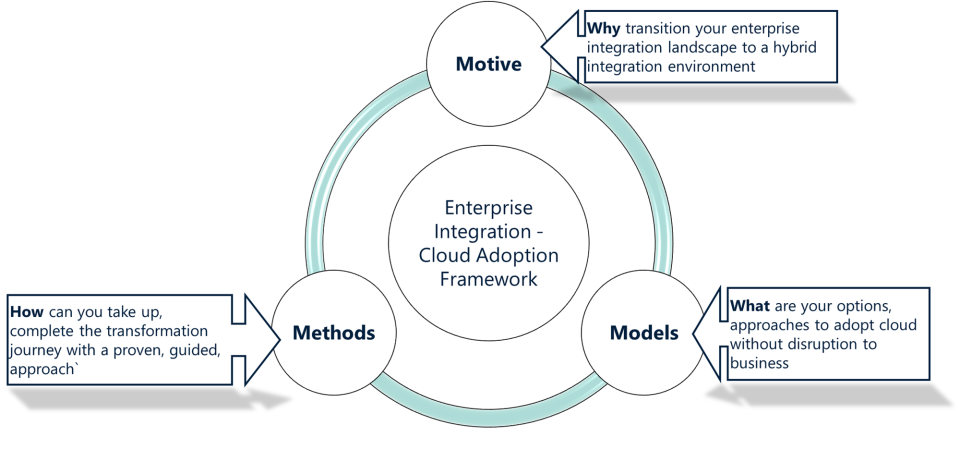
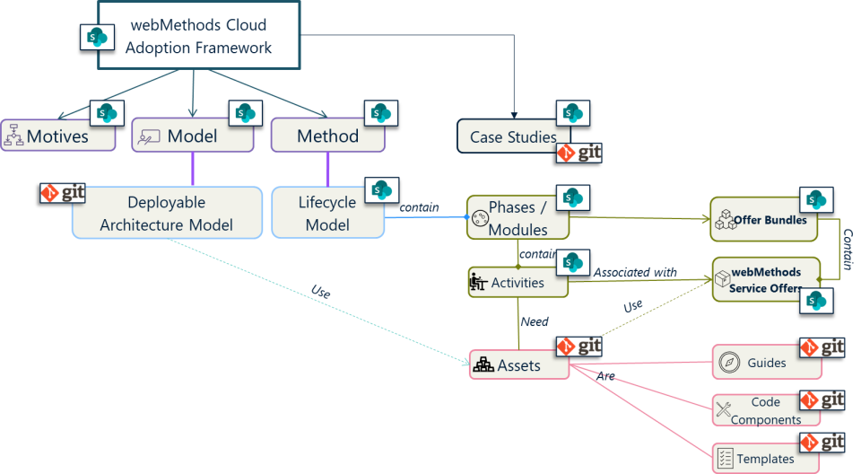

---
tags:
  - Accelerators
---
## Cloud Adoption Framework - Value Triangle

Implementation of cloud-based enterprise integration capabilities require changes not only in the solution design, but also the economic aspects of on-demand resources usage, overall architecture and operational management and governance. In this context, it is critical to start planning the transformation from the key business and I.T objectives, then the various architectural approaches followed by the process and tools for realizing those architectural models. This wholistic approach is the core of Software AG Cloud Adoption Framework.

The three main focus areas of the framework is depicted in the diagram below.

<figure markdown="span">
  { width="600" }
  <figcaption>SAG CAF - Value Tringle</figcaption>
</figure>

**Motive** element deals with key drivers and business / IT objectives of moving from existing architecture to a hybrid cloud model. It captures key aspects to consider when choosing the cloud transformation model and method suitable for specific enterprise environments.

**Models** depict the various approaches suitable for different integration landscapes to do the transition without significant architectural changes or disruption to business, at the same time meeting the cloud adoption goals

**Methods** explains the implementation journey for the different models, starting with a lifecycle model and transition phases. It also contains the different activities associated with each of those phases and the tools / assets that can be used to fulfill the activity.

## Cloud Adoption Framework - Structure

The webMethods cloud adoption use cases are realized with the help of defined Cloud Adoption Frameworks that are tailored for the specific use cases and not a generic, high level model. However, all adoption frameworks will follow the same basic structure and components to assure correctness and completeness of the framework.

The below diagram explains what a webMethods Cloud Adoption Framework comprises of.

<figure markdown="span">
  { width="600" }
  <figcaption>Cloud Adoption Framework - Structure</figcaption>
</figure>

Frameworks that help to realize cloud adoption models chosen to have a define set of lifecycle phases, the phases comprise of Activities and activities are performed with the help of a set of assets. Assets that help to perform an activity can be How-to Guides, pre-defined code components or data capture templates. These assets are part of the asset repository, navigable from the framework home page.

Software AG's packaged service offers helps teams that are trying to take up the transformation journey throughout the journey lifecycle. They could be Advisory offers, Implementation offers or Managed Services offers that helps accelerate the journey.