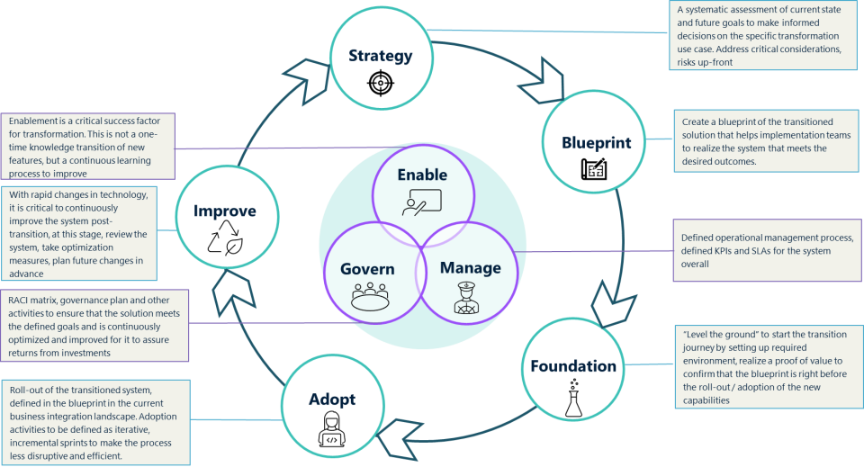

Methods describe the Software AG recommended adoption framework once a suitable model is chosen as the approach to transition the integration landscape that will fulfill the defined motives. An adoption framework comprises of the lifecycle model, its modules and assets that realize the framework.

## The Lifecycle Model

The lifecycle model and phases capture the distinct phases / modules and their detailed set of activities, associated assets and packaged service offers. The lifecycle model acts as the key tool that helps various stakeholders working on different aspects of the cloud adoption journey. The high-level structure of the lifecycle model is depicted in the diagram below

<figure markdown="span">
  { width="600" }
  <figcaption>Cloud Adoption Frameworks - Lifecycle Model</figcaption>
</figure>

The lifecycle model comprises of a set of sequential modules that usually has an entry criteria which will be related to the activities to be performed in the next module. However certain modules are cross-cutting concerns, they span across the sequential modules.

As described in the Models section, there are multiple methods that can be taken to realize a specific cloud adoption choice. Further chapters of this guide explain the various Methods that realize the Models

| Method      | Framework                          |
| ----------- | ------------------------------------ |
| ***Rehost***       |   |
| ***Repackage***      |  |
| ***Refactor***    | [PS Containerization Framework](https://sagportal.sharepoint.com/sites/PSDeliveryAIMTG/SitePages/Containerization-Framework.aspx) |
| ***Re-platform***    |  |
| ***Hybrid-iPaaS***    | [PS Hybrid iPaaS Transformation Framework](https://sagportal.sharepoint.com/sites/PSDeliveryAIMTG/SitePages/IPaaS-Transformation-Framework.aspx) |