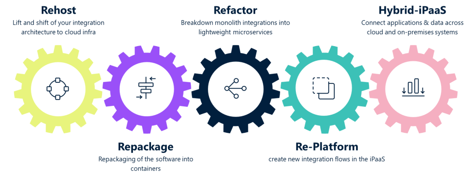

Adoption of cloud grade architectures in the enterprise integration landscape is not something that is achievable by following a standard set of activities in one go. It is a journey, with multiple possible paths and each path having a set of defined phases and activities to get there smoothly and effectively.  The diagram below depicts the high-level possible approaches that can be taken to initiate the transformation journey depending on the enterprise IT boundary conditions such as infrastructure capabilities, budget, skill availability, cost savings etc.

<figure markdown="span">
  { width="600" }
  <figcaption>Adoption models - 5Rs models</figcaption>
</figure>

## Rehosting

**Rehosting**, also known as "lift and shift," is a cloud migration strategy in which you move your applications and data from on-premises infrastructure to the cloud with minimal modifications. This strategy is typically chosen when organizations want to quickly move to the cloud without making extensive changes to their existing systems.
 

***Re-hosting is perfect for customers who want to…***

* First step to cloud and a transitionary state to a more cloud native approach and iPaaS implementation

* Helps with reducing Capex, comes with a lot of operational and cost benefits

* Compliance and Regulatory Concerns, maintain the same application configurations and data storage locations as your on-premises systems

***Why ‘Rehosting’ is a good first step to cloud ?***

* Straightforward path to cloud with minimal modifications, re-architecting or reengineering
* Often combined with hardware upgrades and software upgrades like webMethods version upgrades
* Can be combined with other strategies like repackaging and building new integrations on iPaaS
* Tactical move with minimal disruption and cloud benefits
* Cost effective way to extend the life of legacy systems

## Repackaging

**Repackaging** is a cloud migration strategy that involves encapsulating legacy applications in containers and deploying them in a cloud computing environment. Repackaging can modernize applications without rewriting the entire software code and by deploying as containers, offer portability, scalability, fault tolerance and agility.

***Perfect for you if you want to…***
 

* Modify or transform software applications to make them compatible container distribution methods
* Cloud deployment automation
* Virtualization and Containerization
* Multi cloud environments and adopting multi-cloud integration strategies
* Cloud native setup

***Why ‘Repackage’ is a tactical approach***

* Allows for consistency and standardization in how webMethods is deployed & managed in the cloud
* Take full advantage of cloud-native features, such as auto-scaling, portability, & cloud-native databases
* Initial step for containerization and its benefits, forms the base step for refactoring and breaking down monoliths into microservices
* Small/single domain/functionality webMethods setups can be easily containerized
* Repackaging can help automate software deployment within the cloud environment
* See the [webMethods Containerization Framework](https://sagportal.sharepoint.com/sites/PSDeliveryAIMTG/SitePages/Containerization-Framework.aspx) for details on transitioning to modular, containerized integration environments

## Refactor

***Refactor*** involves breaking down monolithic software to a more manageable pieces that can function independently as microservices. MSRs are typically deployed using containers, scaled using a container orchestration environment like Kubernetes or OpenShift and subsequently monitored using open-source tools like Prometheus. This architecture steps on the foundations of the repackaging.

***Perfect for you if you want to…***
 
* Break large ESBs, Monolithic architecture and Move new integrations to iPaaS
* Adopting cloud native services like managed databases
* Variable workloads and grow or shrink resources as needed, optimizing cost.
* Microservices and API Led architecture

***Why ‘Refactoring’ leads to Re-Platform and Hybrid architectures***

* Allows for breaking down functionality into manageable blocks which can be containerized or moved to iPaaS
* Refactoring gives you flexible and modular solution that can be upgraded or deployed independently
* Cloud-native refactoring often improves the performance of applications by reducing latency and enhancing responsiveness
* Refactoring includes integrating CI/CD pipelines  enabling automated testing, deployment, and rollback
* Refactoring can include changes to ensure compliance with data privacy, residency and sovereignty regulations
* See the [webMethods Containerization Framework](https://sagportal.sharepoint.com/sites/PSDeliveryAIMTG/SitePages/Containerization-Framework.aspx) for details on transitioning to modular, containerized integration environments

## Re-platforming

**Re-platforming** is a pure cloud offering, which easily enables cloud to cloud, or SaaS to SaaS integrations. By using the integration as a SaaS, you can fully forget about the operational aspect of this software layer – the software will be automatically updated and can scale on your demand. It is the natural choice when creating new integration between other cloud native systems or SaaS apps, and it does offer a lot of ready connectors and templates for such applications.

***Perfect for you if you want to…***

* Create new integration flows in the iPaaS
* Connect, integrate and orchestrate with both cloud and on premises applications
* Multi persona approach, Intuitive UI for non-integration experts like citizen integrators and business users
* Develop and deploy apps more quickly

***Why ‘Replatforming” and moving to Super iPaaS is the future***

* Integrating Applications + Data + APIs + B2B + Event streams
* True cloud-first enterprise end-to-end hybrid integration: mainframe to cloud
* Centrally managed governance that has a global reach in light of meeting data sovereignty laws
* A common user interface across all aspects of the platform
* Leverages the power of generative AI to drive agility & productivity

## Hybrid-iPaaS

**Hybrid-iPaaS** is the approach where Software AG's Super iPaaS capabilities can be leveraged to address diverse integration needs in a hybrid cloud application landscape. The degree of cloud capabilities to be adopted is a decision to be done based on a careful analysis of current IT ecosystem as well as motives / business objectives of the adoption of this approach.