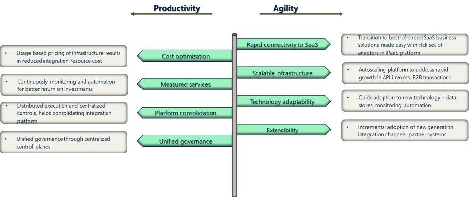

The key business drivers or motives for moving from on-premise / virtualized integration landscape to a managed cloud-native model is no different from the general drivers for enterprise cloud transformations. The key adoption reasons can be classified under two distinct categories 

* Agility / flexibility of the solution to adapt - to business / technology changes
* Improved Productivity with optimal use of resources with automation, continuous monitoring etc.

<figure markdown="span">
  { width="600" }
</figure>

The drivers for moving integration solutions to a cloud based / hybrid integration platform may vary for different customers, but all of them will gain from the advantages when the journey is carefully planned and executed with clear strategy, planning and execution.